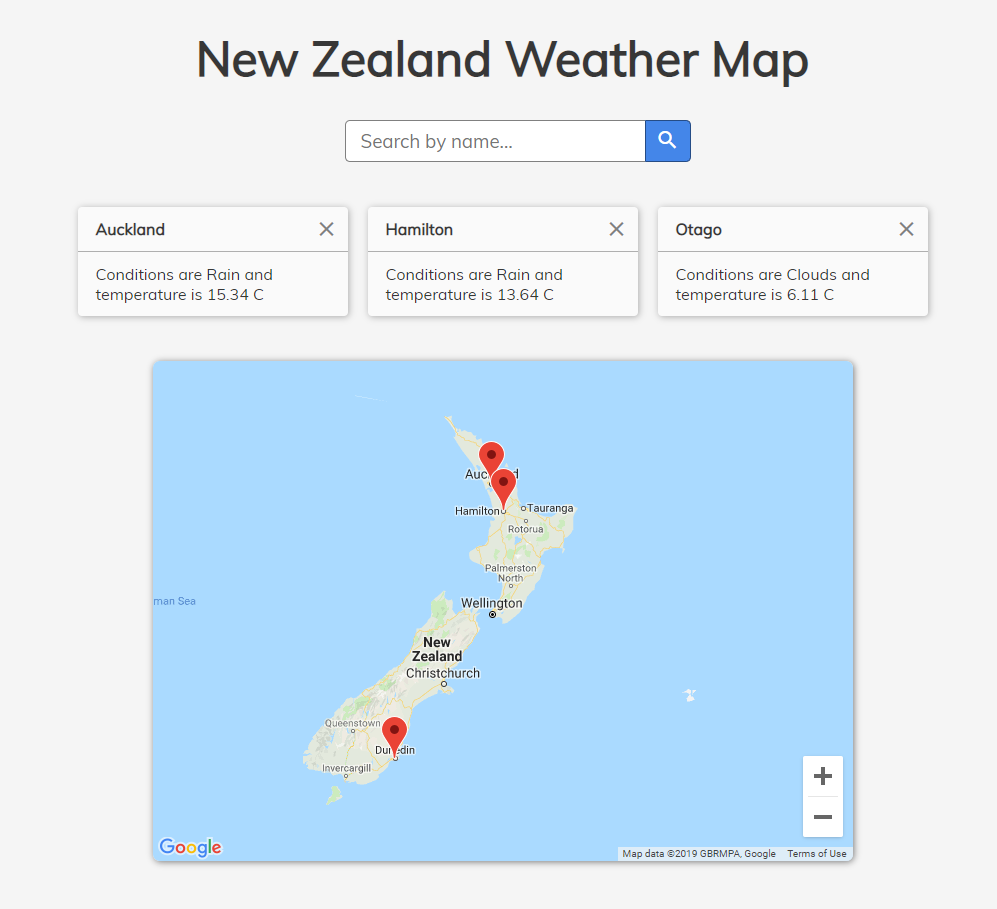

# New Zealand Weather Map
A small React and Node app for interactively viewing weather conditions across New Zealand. Designed to be deployed on IBM Cloud.

[**Live Demo**](https://mbr9-compx341-a3-toolchain.mybluemix.net/)



## Running Locally
Requires Node v10.15.3 and NPM (as well as a IBM Cloudant vcap file for database persitence)

Install Dependancies/Build
```bash
npm install
npm run build
```

Start Server
```bash
npm start
```

Running Tests
```bash
# Unit Tests and Coverage
npm test 
#Function Verification Tests
APP_URL="http://localhost:3456" npm run test-fvt

# Clean up test data and build files
npm run clean
```
Tests are output in jUnit test format and Istanbul json-summary coverage reports. Found at `test/jesttest.xml`, `test/coverage/coverage-summary.json`, `test-fvt/jestfvt.xml`.